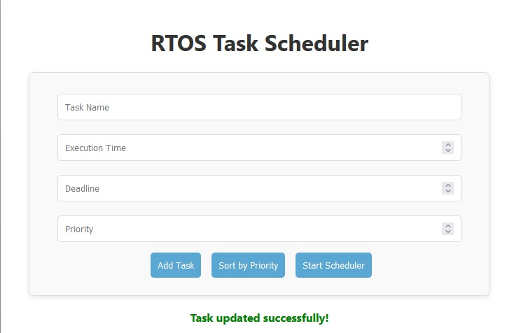
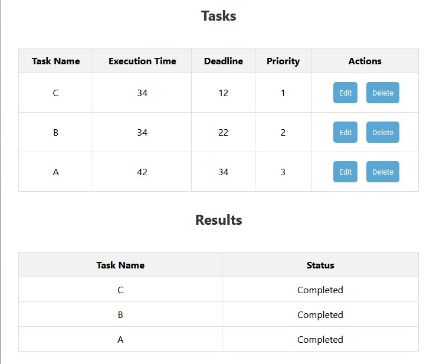

# Dynamic Task Scheduling and Optimization System for Real-Time Operating Systems (RTOS) with Prioritization and Execution Monitoring

A web-based RTOS task scheduler that allows users to add, edit, delete tasks, and simulate task scheduling using a FCFS approach, with real-time status updates and results visualization.

## Introduction
This project implements a web-based RTOS task scheduler, providing a simple and intuitive interface for managing tasks and simulating their execution. Users can add tasks, assign priorities, set deadlines, and view task statuses once they are scheduled.

It aims to give insight into how real-time operating systems schedule tasks with specific priorities and deadlines, allowing users to better understand scheduling strategies and task management in embedded systems.

## Novelty
- Provides a web-based solution for simulating RTOS task scheduling.
- Users can dynamically add, edit, and delete tasks with real-time feedback.
- Uses a priority-based First-Come First-Served (FCFS) scheduler to simulate task execution.
- Displays task statuses such as "Completed" or "Missed Deadline" for real-time tracking.
- Simple and intuitive UI built with ReactJS, making it accessible from any browser.

## Applications and Impact
- Useful in understanding task scheduling algorithms for embedded systems and real-time applications.
- Provides a foundation for more advanced scheduling algorithms in RTOS.
- Can be used in educational settings to teach task scheduling concepts.
- Improves understanding of how task priorities and deadlines impact scheduling outcomes.

## Tech Stack Used
- **Backend**: Flask (Python)
- **Frontend**: ReactJS
- **Styling**: CSS
- **Database**: In-memory (tasks and logs stored in Python lists)
- **CORS Handling**: Flask-CORS
- **Build Tool**: Webpack (ReactJS)
- **Scheduler Logic**: Python Functions

## Project Format Tree
```
.
├── /frontend          
│   ├── /build           
│   └── /src             
│       ├── App.js      
│       ├── App.css     
│       └── index.js      
├── app.py           
├── requirements.txt  
└── README.md            

```


## Installation

Important Commands:
```
pip install -r requirements.txt
```

Run the backend
```
python app.py
```

## Output
- Task List: View added tasks with their details (name, execution time, deadline, priority).
  
- Scheduler Results: View task execution results and their status (Completed or Missed Deadline).
  
- Task Logs: Keep track of task actions (add, delete, update, execute).

## My Details
- **Akash S**
- [LinkedIn: www.linkedin.com/in/akashnb](https://www.linkedin.com/in/akashnb)


